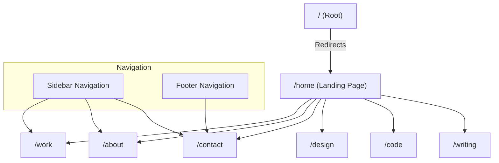

# Information Architecture

## Site Map

The application follows a flat hierarchy with a central landing page and several primary content sections.

## Routes

| Route | Description | Component |
|-------|-------------|-----------|
| `/` | Root entry point, redirects to `/home`. | `app/page.tsx` |
| `/home` | Main landing page. | `app/home/page.tsx` using `components/Main.tsx` |
| `/work` | Portfolio or work showcase. | `app/work/page.tsx` |
| `/about` | Information about the entity/person. | `app/about/page.tsx` |
| `/contact` | Contact information and form. | `app/contact/page.tsx` |
| `/design` | Design portfolio/section. | `app/design/page.tsx` |
| `/code` | Coding projects/section. | `app/code/page.tsx` |
| `/writing` | Blog or writing section. | `app/writing/page.tsx` |
| `*` | 404 Not Found page. | `app/not-found.tsx` |

## Navigation Structure

### Global Navigation (Sidebar)
The application features a collapsible sidebar navigation that is accessible from all pages.
- **State**: Closed by default on `/home`.
- **Behavior**: Automatically closes when a navigation link is clicked.
- **Items**:
    - Work
    - About
    - Contact

### Footer Navigation
A sticky footer provides secondary navigation.
- **Items**:
    - Contact

## Component Hierarchy

- **RootLayout** (`app/layout.tsx`)
    - **Sidebar** (`components/Sidebar.tsx`)
    - **Main Content Area** (`<main>`)
        - *Page Content*
    - **Footer** (`components/Footer.tsx`)

## Assets & Resources
- **Images/Icons**: Stored in `public/assets` and `public/icons`.
- **Styling**: Tailwind CSS with global styles in `app/globals.css`.
- **Fonts**: `Alfa Slab One` (Headings), `Geist` (Body).
